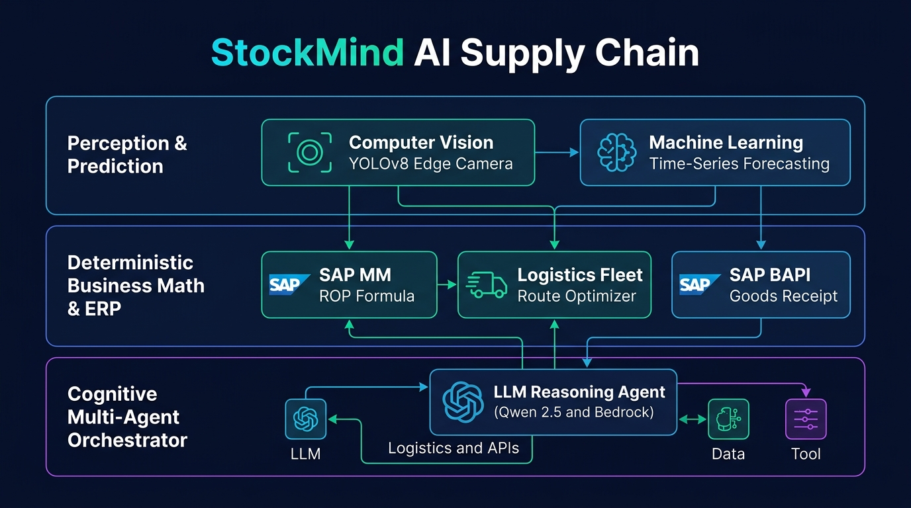

# Arsitektur Resmi Sistem: StockMind AI (Hybrid 3-Tier Architecture)

**Project:** StockMind AI — End-to-End Autonomous Supply Chain Orchestration System  
**Track:** Intelligent Supply Chain (Sokrates × AWS × SAP Partner Hackathon 2026)  
**Dokumen Referensi:** [PRD-SRS-SPECIFICATION.md](PRD-SRS-SPECIFICATION.md), [SYSTEM_IMPLEMENTATION_REPORT.md](SYSTEM_IMPLEMENTATION_REPORT.md)

---

## Diagram Arsitektur Visual (Infografis Sistem)

---

## Penjelasan 3 Layer Arsitektur Pemenang

Arsitektur ini menggabungkan **kecepatan & determinisme logika bisnis ERP** dengan **kemampuan kognitif model AI generatif**, sehingga menghilangkan risiko halusinasi dan sangat hemat komputasi.

### 1. Layer 1: Perception & Prediction (Persepsi & Peramalan)
* **Tujuan:** Mengumpulkan data mentah dari dunia fisik dan tren pasar sebelum diolah oleh logika bisnis.
* **Komponen:**
  1. **Computer Vision (YOLOv8 Edge):** Model Deep Learning (`computer_vision/weights/best.pt`, 5.96MB) yang melakukan inferensi lokal secepat 34.8 ms untuk mendeteksi dan menghitung jumlah kotak kardus fisik di rak gudang (Akurasi 100%, mAP 99.50%).
  2. **Machine Learning (Time-Series Forecasting):** Model prediksi deret waktu (ARIMA / LightGBM / AWS SageMaker DeepAR) yang menganalisis historis penjualan 14–30 hari untuk mendeteksi lonjakan permintaan musiman (+24.2%).

### 2. Layer 2: Deterministic Business Math & ERP (Logika Bisnis & Transaksional)
* **Tujuan:** Memastikan semua perhitungan angka persediaan, jarak logistik, dan transaksi keuangan 100% eksak tanpa halusinasi.
* **Komponen:**
  1. **SAP MM ROP Formula:** Menghitung disparitas stok fisik vs SAP MM, Safety Stock Dinamis ($SS = Z \times \sqrt{L \cdot \sigma_d^2 + d^2 \cdot \sigma_L^2}$), dan Reorder Point ($ROP = d \times L + SS = 52$ Unit).
  2. **Logistics Fleet Route Optimizer:** Algoritma perutean armada (Haversine & Dynamic Rerouting) untuk memitigasi kemacetan jalan tol Cikunir (38.4 km, hemat 24.1% biaya demurrage).
  3. **SAP BAPI Goods Receipt:** Eksekusi mutasi barang otomatis menggunakan skema standar `BAPI_GOODSMVT_CREATE` (Movement Type 101) saat barang tiba di dok penerimaan.

### 3. Layer 3: Cognitive Multi-Agent Orchestrator (Otak Penalaran & Negosiasi)
* **Tujuan:** Menjadi *conductor* yang mengorkestrasi tools, mengevaluasi kontrak rekanan, dan melakukan negosiasi harga.
* **Komponen:**
  1. **LLM Reasoning Agent (Ollama Qwen 2.5 7B Lokal / AWS Bedrock Claude 3.5 Sonnet):** Membaca selisih stok dari Layer 2, menganalisis penawaran dari 3 vendor, menawar diskon secara otomatis (disepakati diskon 8.0%), dan menerbitkan Purchase Order (PO) resmi.
  2. **ReAct Closed-Loop Engine (`multimodal_agent.py`):** Mengatur eksekusi berurutan dari Step 1 hingga 6 secara otonom dalam waktu ~9.5 detik.

---

## Alur Data End-to-End (Data Flow Trace)

1. **Persepsi Fisik:** Kamera gudang (YOLOv8) mendeteksi **46 Kardus**.
2. **Kalkulasi Selisih:** Logika SAP MM membaca saldo sistem = **60**, mendeteksi *Phantom Stock Deficit* = **-14**.
3. **Pemicu ROP:** Karena stok fisik (46) < ROP (52), sistem memicu **Agent Pengadaan Otonom**.
4. **Penalaran AI:** Model AI lokal (Qwen 2.5) membandingkan 3 vendor, menawar harga, dan menerbitkan **PO #45009821** senilai Rp 13.064/unit.
5. **Mitigasi Rute:** Optimizer logistik memandu armada dari Cikarang ke Marunda melalui jalur tol lingkar luar.
6. **Penutupan Siklus (GR 101):** Dokumen e-PoD diverifikasi di dok gudang, memicu `BAPI_GOODSMVT_CREATE`, dan saldo stok SAP pulih menjadi **96 Unit**.
