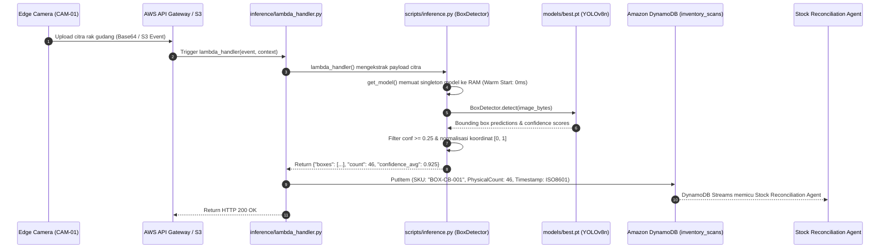
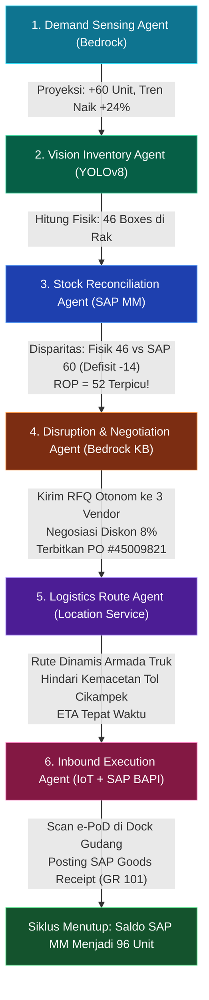
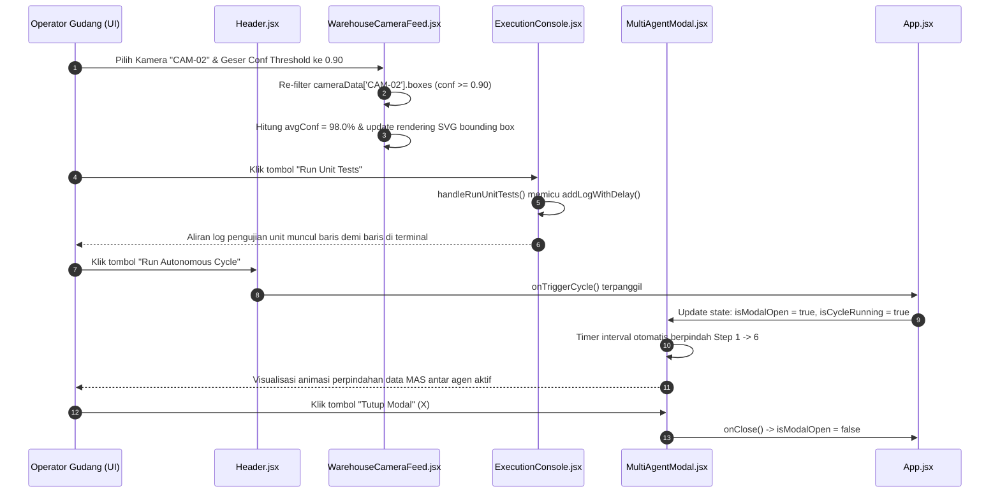

# Workflow Per-File Trace Documentation

**Project**: StockMind AI — End-to-End Autonomous Supply Chain Orchestration System  
**Competition Track**: Intelligent Supply Chain (Sokrates × AWS × SAP Partner — Agentic AI Hackathon 2026)  
**Generated**: September 2026  
**Scope**: Full Stack & Subsystems (Computer Vision Edge Inference, Presentation Frontend Dashboard, Test Automation Suites, Compatibility Execution Wrappers, Build Configurations, and Scaffolded Multi-Agent Architecture)

---

## Table of Contents

1. [Project Structure Overview](#project-structure-overview)
2. [Per-Layer File Analysis](#per-layer-file-analysis)
   - [Layer 1: Computer Vision & Edge Inference Subsystem (`computer_vision/`)](#layer-1-computer-vision--edge-inference-subsystem-computervision)
   - [Layer 2: Frontend Dashboard Presentation Subsystem (`frontend/src/`)](#layer-2-frontend-dashboard-presentation-subsystem-frontendsrc)
   - [Layer 3: Build, Tooling, & Configuration Subsystem](#layer-3-build-tooling--configuration-subsystem)
   - [Layer 4: Execution Scripts & Compatibility Wrappers](#layer-4-execution-scripts--compatibility-wrappers)
   - [Layer 5: Testing & Quality Assurance Subsystem (`tests/`)](#layer-5-testing--quality-assurance-subsystem-tests)
   - [Layer 6: Multi-Agent Architecture & Integration Scaffolding (Phase 2–4 Targets)](#layer-6-multi-agent-architecture--integration-scaffolding-phase-24-targets)
3. [End-to-End Traces](#end-to-end-traces)
   - [Trace 1: Computer Vision Edge Inference to AWS Lambda & DynamoDB Event Flow](#trace-1-computer-vision-edge-inference-to-aws-lambda--dynamodb-event-flow)
   - [Trace 2: Closed-Loop Multi-Agent Supply Chain Orchestration Cycle (6-Pillar MAS)](#trace-2-closed-loop-multi-agent-supply-chain-orchestration-cycle-6-pillar-mas)
   - [Trace 3: Frontend Interactive Vision Inspection & Autonomous Cycle Simulation Flow](#trace-3-frontend-interactive-vision-inspection--autonomous-cycle-simulation-flow)
4. [Audit Notes](#audit-notes)
   - [Undocumented Files](#undocumented-files)
   - [Ghost / Dead Files & Reference Discrepancies](#ghost--dead-files--reference-discrepancies)
   - [High Complexity Files](#high-complexity-files)
   - [Open Questions & Architectural Alignment for Team](#open-questions--architectural-alignment-for-team)
5. [Notes for Maintenance](#notes-for-maintenance)

---

## Project Structure Overview

StockMind AI dirancang dengan pola arsitektur **Multi-Agent System (MAS)** siklus tertutup 6 pilar yang menghubungkan dunia fisik gudang dengan ekosistem enterprise AWS dan SAP S/4HANA:

```text
┌─────────────────────────────────────────────────────────────────────────────┐
│                       STOCKMIND AI ARCHITECTURE                             │
└─────────────────────────────────────────────────────────────────────────────┘

 [PILAR 1: Demand Sensing]       [PILAR 2: Vision Inventory]       [PILAR 3: Stock Reconciliation]
  Amazon Bedrock + SageMaker      YOLOv8n Edge / AWS Lambda         SAP S/4HANA MM + Bedrock Agent
  (Peramalan Time-Series Sales)   (Deteksi Fisik Kotak di Rak)      (Hitung Disparitas & ROP)
              │                               │                                 │
              └───────────────┬───────────────┴─────────────────────────────────┘
                              ▼
                 [MULTI-AGENT ORCHESTRATOR]
                 (Amazon Bedrock + Step Functions)
                              │
              ┌───────────────┴───────────────┬─────────────────────────────────┐
              ▼                               ▼                                 ▼
 [PILAR 4: Negotiation]          [PILAR 5: Logistics Route]        [PILAR 6: Inbound Execution]
  Bedrock KB + SAP Ariba          Amazon Location Service           AWS IoT + SAP BAPI
  (Otomasi RFQ & PO Vendor)       (Rute Dinamis Armada Truk)        (Scan e-PoD & Goods Receipt 101)

───────────────────────────────────────────────────────────────────────────────
                      PRESENTATION & OPERATIONAL CONTROL
  React 18 + Vite + Tailwind CSS Enterprise Dashboard (7 Dedicated Domain Views)
───────────────────────────────────────────────────────────────────────────────
```

### Relasi Layer Codebase Saat Ini

1. **`computer_vision/`**: Subsystem inti Fase 1 yang mengolah citra rak gudang, melakukan inferensi deteksi objek kotak kardus (`cardboard_box`), menghasilkan kontrak data JSON, dan menjadi adapter AWS Lambda.
2. **`frontend/`**: Antarmuka monitoring real-time berbasis web untuk menavigasi status 6 agen otonom, feeds kamera inspeksi, log eksekusi terminal, dan kontrol orkestrasi rantai pasok.
3. **`tests/`**: Unit test suite otomatis yang memvalidasi kontrak skema JSON, batas latensi <500ms, dan normalisasi koordinat bounding box sebelum deployment.
4. **`scripts/` & `notebooks/`**: Script pembantu dan wrapper eksekusi root workspace untuk mempermudah eksekusi training/evaluasi baik di lokal maupun Google Colab.
5. **`agents/`, `backend/`, `integrations/`, `infra/`**: Modul arsitektural terstruktur yang disiapkan (scaffolded) untuk tahap integrasi layanan cloud AWS dan ERP SAP pada fase berikutnya.

---

## Per-Layer File Analysis

### Layer 1: Computer Vision & Edge Inference Subsystem (`computer_vision/`)

Subsystem ini mengelola seluruh siklus hidup model deteksi visual: mulai dari seeding dataset sintetis, validasi label YOLO, training bobot nano (`best.pt`), evaluasi metrik akurasi mAP@50, hingga inferensi ultra-ringan terstandarisasi untuk AWS Lambda.

---

#### `computer_vision/inference/lambda_handler.py`
**Peran:** Adapter entry point resmi AWS Lambda untuk Vision Inventory Agent (Agent #2).  
**Import lokal:** [computer_vision/scripts/inference.py](../computer_vision/scripts/inference.py)

| Entry Point | Called By | Calls | Input | Output / Side Effect |
|---|---|---|---|---|
| `lambda_handler(event: Dict[str, Any], context: Any)` | AWS Lambda Runtime Event Trigger (S3 bucket upload event atau API Gateway POST) | `computer_vision.scripts.inference::lambda_handler()` | `event` (dict berisi `body`, `image_base64`, atau `s3` metadata), `context` (AWS Lambda runtime context object) | Mengembalikan response JSON standar HTTP `{ "statusCode": 200, "headers": {...}, "body": "..." }` berisi koordinat box, jumlah unit fisik, dan confidence score. |
| `BoxDetector` *(re-exported class)* | Modul backend atau integration test eksternal | `computer_vision.scripts.inference::BoxDetector` | Path model dan threshold konfidensi | Instansiasi detektor YOLOv8n. |
| `get_model` *(re-exported function)* | Handler serverless internal | `computer_vision.scripts.inference::get_model` | `model_path: Optional[str]` | Mengembalikan singleton instance `ultralytics.YOLO`. |

---

#### `computer_vision/scripts/inference.py`
**Peran:** Mesin inferensi utama deteksi objek kardus bebas dependensi berat, dioptimalkan untuk warm-start serverless.  
**Import lokal:** Tidak ada (mengimpor modul standar Python: `io`, `os`, `sys`, `json`, `time`, `base64`, `argparse`, `pathlib`, `typing`).

| Entry Point | Called By | Calls | Input | Output / Side Effect |
|---|---|---|---|---|
| `get_model(model_path: Optional[str] = None)` | `BoxDetector.__init__()`, AWS warm start | `ultralytics.YOLO()` | `model_path`: string path ke file `best.pt` (default: environment variable `MODEL_PATH` atau `computer_vision/models/best.pt`) | Mengembalikan instance global `_GLOBAL_MODEL` (singleton pattern di memori untuk eliminasi cold start overhead). |
| `BoxDetector.__init__(model_path: Optional[str], conf_threshold: float = 0.25)` | `tests/unit/test_vision_inference.py`, `lambda_handler()`, CLI `main()` | `get_model()` | `model_path`: path bobot model, `conf_threshold`: batas minimal nilai keyakinan deteksi (default 0.25) | Menginisialisasi objek detektor dan menetapkan threshold deteksi. |
| `BoxDetector.detect(image_input: Union[bytes, str, Path, Any])` | `lambda_handler()`, CLI `main()`, Unit Test | `self.model.predict()`, `PIL.Image.open()` | `image_input`: raw image bytes, base64 string, Path objek, atau path string | Return `Dict[str, Any]` dengan skema terstandarisasi: `{"boxes": [{"x": float, "y": float, "w": float, "h": float, "conf": float}], "count": int, "confidence_avg": float}`. Normalisasi koordinat [0.0 - 1.0]. |
| `lambda_handler(event: Dict[str, Any], context: Any)` | `computer_vision/inference/lambda_handler.py`, AWS Lambda runtime | `BoxDetector.detect()` | `event`: payload AWS Lambda (bisa memuat base64 image pada `event["image_base64"]` atau `event["body"]`), `context`: AWS context | Return API Gateway proxy dict: status code 200/400/500 beserta JSON stringified payload yang memuat `timestamp`, `status`, `count`, `confidence_avg`, `boxes`, dan `model_version`. |
| `main()` | Terminal CLI via `python inference.py --image <path>` | `argparse.ArgumentParser()`, `BoxDetector.detect()` | Argumen CLI: `--image`, `--model`, `--conf`, `--output-json` | Mencetak hasil deteksi JSON ke stdout, menyimpan file output opsional ke disk, mencatat durasi inferensi ke konsol. |

---

#### `computer_vision/scripts/evaluate_model.py`
**Peran:** Script benchmark dan evaluasi performa kuantitatif model YOLOv8 pada split dataset test.  
**Import lokal:** Tidak ada (mengimpor `os`, `sys`, `csv`, `glob`, `shutil`, `argparse`, `pathlib`, `ultralytics.YOLO`).

| Entry Point | Called By | Calls | Input | Output / Side Effect |
|---|---|---|---|---|
| `parse_args()` | `run_evaluation()` | `argparse.ArgumentParser.parse_args()` | CLI arguments: `--model`, `--data`, `--split`, `--imgsz`, `--conf`, `--output-csv`, `--save-plots` | Return objek `argparse.Namespace` ter-parse. |
| `check_dependencies()` | `run_evaluation()` | Tidak ada | Tidak ada | Memvalidasi ketersediaan package `ultralytics` dan `PIL`. Menghentikan eksekusi dengan pesan edukatif jika library belum terpasang. |
| `generate_prediction_visualizations(model, test_img_dir: Path, output_pred_dir: Path, conf: float)` | `run_evaluation()` | `model.predict()` | Model YOLO loaded, direktori citra uji, direktori target visualisasi, float threshold | Menyimpan citra beranotasi bounding box hasil inferensi ke disk (`computer_vision/results/predictions/`). |
| `provide_tuning_recommendations(map50: float, precision: float, recall: float)` | `run_evaluation()` | Tidak ada | Metrik numerik evaluasi hasil validasi | Mencetak tips analisis engineering ke terminal terkait underfitting, overconfidence, atau dataset bias. |
| `run_evaluation()` | CLI `python evaluate_model.py` | `model.val()`, `generate_prediction_visualizations()`, `provide_tuning_recommendations()` | Parameter evaluasi CLI | Menulis laporan CSV ke `computer_vision/results/model_evaluation_epoch50.csv`, mencatat ringkasan performa (mAP@50, precision, recall, latency), menulis ringkasan markdown `computer_vision/results/README_vision.md`. |

---

#### `computer_vision/scripts/train_yolov8.py`
**Peran:** Script orkestrasi training model YOLOv8n (nano) berbasis murni skrip Python untuk kepatuhan SLA AWS Lambda (<50MB).  
**Import lokal:** Tidak ada (mengimpor `os`, `sys`, `shutil`, `argparse`, `pathlib`, `ultralytics.YOLO`).

| Entry Point | Called By | Calls | Input | Output / Side Effect |
|---|---|---|---|---|
| `parse_args()` | `run_training()` | `argparse.ArgumentParser.parse_args()` | Argumen CLI: `--data`, `--model`, `--epochs`, `--imgsz`, `--batch`, `--device`, `--name` | Return namespace konfigurasi training. |
| `check_dependencies()` | `run_training()` | Tidak ada | Tidak ada | Memvalidasi ketersediaan PyTorch dan Ultralytics. |
| `run_training()` | CLI `python train_yolov8.py`, notebook wrappers | `YOLO.train()`, `shutil.copy2()` | Parameter hyperparameter training | Menjalankan epoch training, menyimpan checkpoint `runs/detect/`, menyalin `best.pt` dan `last.pt` ke `computer_vision/models/`, mencetak validasi SLA Lambda (<50 MB). |

---

#### `computer_vision/scripts/validate_dataset.py`
**Peran:** Auditor dataset otomatis sebelum training untuk menjamin kualitas format YOLO, koordinat box [0.0 - 1.0], dan integritas file gambar.  
**Import lokal:** Tidak ada (mengimpor `sys`, `argparse`, `pathlib`, `PIL.Image`, `yaml`).

| Entry Point | Called By | Calls | Input | Output / Side Effect |
|---|---|---|---|---|
| `load_data_yaml(yaml_path: Path)` | `main()` | `yaml.safe_load()` | Path ke file konfigurasi dataset `data.yaml` | Return dict konfigurasi dataset (path train/val/test, jumlah kelas `nc`, daftar nama kelas `names`). |
| `find_split_directories(data_dir: Path, split: str)` | `main()` | `Path.exists()` | Direktori root dataset dan nama split (`train`, `val`, `test`) | Mengembalikan tuple `(images_dir, labels_dir)` yang valid. |
| `find_label_file(img_path: Path, lbl_dir: Path)` | `validate_split()` | `lbl_dir.glob()` | Path file gambar dan direktori file label txt | Return path file label `.txt` yang berkorespondensi. |
| `validate_split(split_name: str, img_dir: Path, lbl_dir: Path, expected_classes: List[str])` | `main()` | `PIL.Image.open()`, `find_label_file()` | Nama split, direktori gambar, direktori label, list nama kelas | Return dict statistik: jumlah citra valid/korup, bounding box valid/invalid, unlabelled images, orphan label files. |
| `generate_report(data_dir: Path, yaml_info: dict, split_stats: dict, output_path: Path)` | `main()` | `output_path.write_text()` | Metadata YAML, kumpulan statistik split, path output report | Menulis file laporan audit markdown ke `computer_vision/results/dataset_validation_report.md`. |
| `main()` | CLI `python validate_dataset.py --data data.yaml` | `load_data_yaml()`, `validate_split()`, `generate_report()` | Argumen baris perintah `--data`, `--report` | Menampilkan checklist kelulusan dataset di konsol (exit code 0 jika lolos, 1 jika gagal). |

---

#### `computer_vision/scripts/seed_sample_dataset.py`
**Peran:** Generator dataset sintetis citra rak gudang untuk pengujian pipeline offline dan cold-start.  
**Import lokal:** Tidak ada (mengimpor `os`, `random`, `argparse`, `pathlib`, `PIL.Image`, `PIL.ImageDraw`).

| Entry Point | Called By | Calls | Input | Output / Side Effect |
|---|---|---|---|---|
| `generate_warehouse_box_image(img_id: int, width: int, height: int)` | `seed_dataset()` | `PIL.Image.new()`, `PIL.ImageDraw.Draw()` | ID citra, lebar pixel (640), tinggi pixel (640) | Return tuple `(image_object, bounding_boxes_yolo_format)`. Menggambar rak abu-abu dan kardus cokelat dengan variasi bayangan. |
| `seed_dataset(base_dir: Path, counts: dict)` | CLI `main()` via `python seed_sample_dataset.py` | `generate_warehouse_box_image()`, `Image.save()` | Path target dataset dan dict kuota split `{'train': 30, 'val': 8, 'test': 8}` | Menulis file `.jpg` dan `.txt` ke folder `computer_vision/data/images/` dan `computer_vision/data/labels/`. Menghasilkan sample test images di `computer_vision/data/test_images/`. |

---

#### `computer_vision/notebooks/01_yolo8_training.py`
**Peran:** Script training YOLOv8n berbasis `.py` (pengganti `.ipynb`) yang dioptimalkan untuk eksekusi serverless/Google Colab dari dalam subfolder CV.  
**Import lokal:** [computer_vision/scripts/train_yolov8.py](../computer_vision/scripts/train_yolov8.py)

| Entry Point | Called By | Calls | Input | Output / Side Effect |
|---|---|---|---|---|
| Module Execution (Top-Level) | Python CLI / Colab cell execution | `computer_vision.scripts.train_yolov8::run_training()` | Menyesuaikan `sys.path` dengan `PROJECT_ROOT` dan `CV_ROOT` | Menjalankan pipeline training YOLOv8 dan mengekspor bobot ke `computer_vision/models/best.pt`. |

---

#### `computer_vision/data/data.yaml`
**Peran:** Manifest dataset YOLO standard yang mendefinisikan lokasi split dataset dan kelas target.  
**Import lokal:** None (Konfigurasi deklaratif YAML).

| Entry Point | Called By | Calls | Input | Output / Side Effect |
|---|---|---|---|---|
| Dataset Schema (`train`, `val`, `test`, `nc`, `names`) | `validate_dataset.py`, `train_yolov8.py`, `evaluate_model.py` | Parsed via `yaml.safe_load()` | Path relatif: `images/train`, `images/val`, `images/test` | Mendeklarasikan 1 kelas target deteksi: `cardboard_box` (`nc: 1`). |

---

#### Package Init Files:
- **`computer_vision/__init__.py`**: Mendeklarasikan `computer_vision` sebagai modul Python tingkat atas.
- **`computer_vision/inference/__init__.py`**: Mengimpor dan mengekspor `lambda_handler`, `BoxDetector`, dan `get_model`.
- **`computer_vision/scripts/__init__.py`**: Menandai folder skrip sebagai importable package untuk unit testing.

---

### Layer 2: Frontend Dashboard Presentation Subsystem (`frontend/src/`)

Subsystem ini dibangun dengan **React 18**, **Vite**, dan **Tailwind CSS**, menyajikan antarmuka *Enterprise Control Center* untuk memantau, memvalidasi, dan mengendalikan alur kerja 6 agen rantai pasok otonom.

---

#### `frontend/src/main.jsx`
**Peran:** Titik masuk (entry point) aplikasi React ke Document Object Model (DOM).  
**Import lokal:** [frontend/src/App.jsx](../frontend/src/App.jsx), [frontend/src/index.css](../frontend/src/index.css)

| Entry Point | Called By | Calls | Input | Output / Side Effect |
|---|---|---|---|---|
| `ReactDOM.createRoot().render()` | Browser HTTP Load (`index.html`) | `React.StrictMode`, `<App />` | Elemen DOM `document.getElementById('root')` | Me-render pohon komponen React ke browser dan menerapkan stylesheet Tailwind. |

---

#### `frontend/src/App.jsx`
**Peran:** Komponen root penampung state global navigasi tab, pemicu siklus MAS, dan rendering modal.  
**Import lokal:**
- Components: `Sidebar.jsx`, `Header.jsx`, `MultiAgentModal.jsx`
- Views: `OverviewView.jsx`, `VisionAgentView.jsx`, `DemandSensingView.jsx`, `StockReconciliationView.jsx`, `ProcurementView.jsx`, `LogisticsView.jsx`, `SettingsView.jsx`

| Entry Point | Called By | Calls | Input | Output / Side Effect |
|---|---|---|---|---|
| `App()` *(default export)* | `main.jsx` | `<Sidebar />`, `<Header />`, `<MultiAgentModal />`, Active View Components | Global React State (`activeTab`, `isModalOpen`, `isCycleRunning`) | Mengatur rute tampilan aktif, menangani event navigasi antar-modul, dan memicu modal orkestrasi otonom. |
| `handleTriggerCycle()` *(internal handler)* | Callback props pada `<Header />` dan `<OverviewView />` | `setIsModalOpen(true)`, `setIsCycleRunning(true)` | Event klik tombol pengguna | Membuka modal simulasi siklus tertutup 6 pilar otonom. |

---

#### `frontend/src/components/Header.jsx`
**Peran:** Bilah header atas yang menampilkan status konektivitas AWS/SAP, indikator jam operasional, dan pemicu siklus otonom.  
**Import lokal:** Tidak ada (mengimpor icon `lucide-react`).

| Entry Point | Called By | Calls | Input | Output / Side Effect |
|---|---|---|---|---|
| `Header({ onTriggerCycle, isCycleRunning })` | `App.jsx` | `onTriggerCycle()` | Props function `onTriggerCycle`, boolean `isCycleRunning` | Menampilkan live clock UTC/WIB, badge status sinkronisasi cloud, dan tombol aksi "Run Autonomous Cycle". |

---

#### `frontend/src/components/Sidebar.jsx`
**Peran:** Panel navigasi sisi kiri untuk beralih antar 7 modul operasional rantai pasok.  
**Import lokal:** Tidak ada (mengimpor icon `lucide-react`).

| Entry Point | Called By | Calls | Input | Output / Side Effect |
|---|---|---|---|---|
| `Sidebar({ activeTab, setActiveTab })` | `App.jsx` | `setActiveTab(id: string)` | Props string `activeTab` ('overview', 'vision', 'demand', dll.), setter `setActiveTab` | Mengubah state navigasi di root `App.jsx` saat pengguna mengklik item menu. |

---

#### `frontend/src/components/KpiCards.jsx`
**Peran:** Baris kartu metrik ringkasan SLA (mAP@50 99.50%, Latency 34.8ms, Model 5.96MB, Akurasi 100%).  
**Import lokal:** Tidak ada (mengimpor icon `lucide-react`).

| Entry Point | Called By | Calls | Input | Output / Side Effect |
|---|---|---|---|---|
| `KpiCards()` | `VisionAgentView.jsx` | Tidak ada | Data statis metrik evaluasi model | Menampilkan 4 kartu performa teknis subsystem computer vision. |

---

#### `frontend/src/components/WarehouseCameraFeed.jsx`
**Peran:** Komponen inspeksi visual kamera gudang interaktif dengan rendering bounding box YOLO dan simulasi inferensi real-time.  
**Import lokal:** Tidak ada (menggunakan aset gambar publik `/warehouse_box_test_0001.jpg` s/d `0008.jpg`).

| Entry Point | Called By | Calls | Input | Output / Side Effect |
|---|---|---|---|---|
| `WarehouseCameraFeed()` | `VisionAgentView.jsx` | Internal state: `selectedCam`, `showBoxes`, `showConf`, `isRefreshing`, `latency` | State seleksi kamera (`CAM-01`, `CAM-02`, `CAM-03`) | Menghitung rata-rata konfidensi secara dinamis, me-render koordinat bounding box di atas canvas citra, dan mensimulasikan latensi inferensi CPU warm-start (~34.8ms). |
| `handleRefresh()` *(internal handler)* | Klik tombol "Trigger Re-Scan" | `setTimeout()`, `setLatency()` | Event klik | Mensimulasikan jeda inferensi edge camera dan memperbarui waktu pemindaian terakhir. |

---

#### `frontend/src/components/ExecutionConsole.jsx`
**Peran:** Emulator terminal CLI interaktif yang mensimulasikan eksekusi script Python (`validate_dataset`, `test_vision_inference`, `evaluate_model`, `inference`) beserta event bus DynamoDB & SAP RFC.  
**Import lokal:** Tidak ada (mengimpor icon `lucide-react`).

| Entry Point | Called By | Calls | Input | Output / Side Effect |
|---|---|---|---|---|
| `ExecutionConsole()` | `VisionAgentView.jsx` | `handleValidateDataset()`, `handleRunUnitTests()`, `handleEvaluateModel()`, `handleLiveInference()` | State `logs` (array of terminal entries) | Menampilkan antarmuka terminal bergaya hacker/enterprise dengan fitur auto-scroll dan salin log ke clipboard. |
| `handleValidateDataset()` | Klik tombol 1 "Validate Dataset" | `addLogWithDelay()` | Tidak ada | Menambahkan aliran log verifikasi dataset `data.yaml` ke emulator terminal. |
| `handleRunUnitTests()` | Klik tombol 2 "Run Unit Tests" | `addLogWithDelay()` | Tidak ada | Mensimulasikan output `test_vision_inference.py` (5 tests PASSED). |
| `handleEvaluateModel()` | Klik tombol 3 "Evaluate mAP" | `addLogWithDelay()` | Tidak ada | Mensimulasikan benchmark metrik akurasi mAP@50 = 99.50%. |
| `handleLiveInference()` | Klik tombol 4 "Test Inference" | `addLogWithDelay()` | Tidak ada | Mensimulasikan pemanggilan `lambda_handler()` dan penulisan event ke AWS DynamoDB table `stockmind-inventory-events`. |

---

#### `frontend/src/components/MultiAgentModal.jsx`
**Peran:** Modal dialog interaktif yang memperagakan orkestrasi closed-loop 6 pilar Multi-Agent System secara berurutan saat tombol "Run Autonomous Cycle" ditekan.  
**Import lokal:** Tidak ada (mengimpor icon `lucide-react`).

| Entry Point | Called By | Calls | Input | Output / Side Effect |
|---|---|---|---|---|
| `MultiAgentModal({ isOpen, onClose })` | `App.jsx` | Internal interval timer: `setCurrentStep()` | Props boolean `isOpen`, callback `onClose` | Menjalankan animasi transisi otomatis dari Agen #1 (Demand Sensing) hingga Agen #6 (Inbound Goods Receipt SAP), menampilkan pertukaran payload data antar agen. |

---

#### Views Layer (`frontend/src/views/`):

- **`OverviewView.jsx`**:
  - **Peran:** Dashboard eksekutif rantai pasok dengan rekapitulasi status seluruh pilar, visualisasi alur Closed-Loop MAS, peringatan stok kritis, dan grafik metrik utama.
  - **Entry Point:** `OverviewView({ onNavigateToVision, onTriggerCycle })`.
  - **Called By:** `App.jsx` saat `activeTab === 'overview'`.

- **`VisionAgentView.jsx`**:
  - **Peran:** Hub teknis khusus Pilar 2 (Vision Inventory Agent), menggabungkan [KpiCards.jsx](../frontend/src/components/KpiCards.jsx), [WarehouseCameraFeed.jsx](../frontend/src/components/WarehouseCameraFeed.jsx), dan [ExecutionConsole.jsx](../frontend/src/components/ExecutionConsole.jsx).
  - **Entry Point:** `VisionAgentView()`.
  - **Called By:** `App.jsx` saat `activeTab === 'vision'`.

- **`DemandSensingView.jsx`**:
  - **Peran:** Tampilan analitik Pilar 1 (Demand Sensing Agent berbasis Bedrock & SageMaker), menampilkan proyeksi lonjakan permintaan 14 hari, estimasi probabilitas stockout, dan tombol `handleRunProjection()`.
  - **Entry Point:** `DemandSensingView()`.
  - **Called By:** `App.jsx` saat `activeTab === 'demand'`.

- **`StockReconciliationView.jsx`**:
  - **Peran:** Tampilan Pilar 3 (Stock Reconciliation Agent), membandingkan saldo pembukuan SAP S/4HANA MM (60 unit) vs hasil hitungan visual kamera (46 unit), menghitung Dynamic Safety Stock, dan memicu tombol `handleReconcile()`.
  - **Entry Point:** `StockReconciliationView()`.
  - **Called By:** `App.jsx` saat `activeTab === 'reconciliation'`.

- **`ProcurementView.jsx`**:
  - **Peran:** Tampilan Pilar 4 (Disruption & Negotiation Agent), menampilkan perbandingan penawaran RFQ vendor rekanan (PT Mitra Logistik, CV Sumber Rezeki, dll.), transkrip otonom negosiasi harga Bedrock LLM, dan penerbitan Purchase Order otomatis.
  - **Entry Point:** `ProcurementView()`.
  - **Called By:** `App.jsx` saat `activeTab === 'procurement'`.

- **`LogisticsView.jsx`**:
  - **Peran:** Tampilan Pilar 5 & 6 (Logistics Route & Inbound Execution), menampilkan peta rute armada Amazon Location Service, mitigasi kemacetan tol, scan barcode e-PoD di dok penerimaan, serta tombol eksekusi `handlePostGoodsReceipt()` (SAP BAPI 101).
  - **Entry Point:** `LogisticsView()`.
  - **Called By:** `App.jsx` saat `activeTab === 'logistics'`.

- **`SettingsView.jsx`**:
  - **Peran:** Panel konfigurasi parameter sistem (AWS Region, DynamoDB Table Name, SAP Destination Host, ROP Sensitivity, LLM Guardrail Thresholds), dilengkapi handler `handleTestSap()` dan `handleSave()`.
  - **Entry Point:** `SettingsView()`.
  - **Called By:** `App.jsx` saat `activeTab === 'settings'`.

- **`frontend/src/index.css`**:
  - **Peran:** Stylesheet global aplikasi yang mengimpor direktif Tailwind (`@tailwind base; @tailwind components; @tailwind utilities;`) serta custom styling scrollbar terminal konsol.

---

### Layer 3: Build, Tooling, & Configuration Subsystem

Layer ini mengatur pipeline kompilasi, dependensi pustaka, dan konfigurasi environment backend & frontend.

---

#### `frontend/package.json` & `frontend/package-lock.json`
**Peran:** Deklarasi dependensi Node.js, metadata project frontend, dan scripts runner.  
**Daftar Script:**
- `npm run dev`: Menjalankan Vite development server lokal di port 5173.
- `npm run build`: Melakukan bundling produksi aplikasi ke folder `dist/`.
- `npm run preview`: Menguji bundle produksi secara lokal.

**Dependensi Utama:** `react` (^18.2.0), `react-dom` (^18.2.0), `lucide-react` (^0.344.0), `vite` (^5.1.4), `tailwindcss` (^3.4.1), `postcss` (^8.4.35), `autoprefixer` (^10.4.18).

---

#### `frontend/vite.config.js`
**Peran:** Konfigurasi build tool Vite.  
**Entry Point:** `defineConfig({ plugins: [react()] })`. Menghubungkan plugin `@vitejs/plugin-react` untuk kompilasi JSX dan modul hot-reload (HMR).

---

#### `frontend/tailwind.config.js` & `frontend/postcss.config.js`
**Peran:** Konfigurasi utilitas styling CSS.  
**Cakupan Content:** Mendeteksi seluruh file di `./index.html` dan `./src/**/*.{js,ts,jsx,tsx}`. Menambahkan palet warna kustom modern (`slate`, `emerald`, `cyan`, `blue`).

---

#### `frontend/index.html`
**Peran:** Halaman shell HTML tunggal (Single Page Application) yang menyediakan mount point `<div id="root"></div>` dan memuat `/src/main.jsx`.

---

#### `pyrightconfig.json`
**Peran:** Konfigurasi static type checker (Pyright / Pylance) untuk Python di VS Code / Antigravity IDE.  
**Konfigurasi Utama:** Menetapkan `venvPath: "."`, `venv: ".venv"`, `pythonVersion: "3.11"`, dan menambahkan `stockmind-ai` serta `stockmind-ai/computer_vision` ke `extraPaths` agar import lokal dapat di-resolve tanpa error linting.

---

### Layer 4: Execution Scripts & Compatibility Wrappers

Layer ini menyediakan entry point ramah pengguna di level root repository untuk memfasilitasi integrasi otomatis dan eksekusi di lingkungan berbeda (seperti Google Colab atau Jenkins/GitHub Actions).

---

#### `scripts/train_yolov8.py`
**Peran:** Wrapper tingkat root project untuk menjalankan script training Computer Vision tanpa harus berpindah subdirektori.  
**Import lokal:** [computer_vision/scripts/train_yolov8.py](../computer_vision/scripts/train_yolov8.py)

| Entry Point | Called By | Calls | Input | Output / Side Effect |
|---|---|---|---|---|
| Module Execution (Top-Level) | CLI: `python scripts/train_yolov8.py [args]` | `computer_vision.scripts.train_yolov8::run_training()` | Menambahkan root dan `computer_vision` ke `sys.path`, meneruskan `sys.argv` | Menjalankan modul training YOLOv8n dan menyimpan bobot ke folder models. |

---

#### `notebooks/01_yolo8_training.py`
**Peran:** Wrapper kompatibilitas training di root folder `notebooks/` untuk lingkungan komputasi notebook atau developer yang bekerja dari root project.  
**Import lokal:** [computer_vision/scripts/train_yolov8.py](../computer_vision/scripts/train_yolov8.py)

| Entry Point | Called By | Calls | Input | Output / Side Effect |
|---|---|---|---|---|
| Module Execution (Top-Level) | CLI: `python notebooks/01_yolo8_training.py` | `computer_vision.scripts.train_yolov8::run_training()` | Argumen baris perintah | Menjalankan training dan sinkronisasi model. |

---

### Layer 5: Testing & Quality Assurance Subsystem (`tests/`)

Subsystem pengujian otomatis untuk menjamin keandalan sistem sebelum integrasi lebih lanjut.

---

#### `tests/unit/test_vision_inference.py`
**Peran:** Test suite pengujian unit berbasis `unittest` untuk memvalidasi kepatuhan kontrak data inferensi dan performa inferensi CPU warm start.  
**Import lokal:** [computer_vision/scripts/inference.py](../computer_vision/scripts/inference.py)

| Entry Point | Called By | Calls | Input | Output / Side Effect |
|---|---|---|---|---|
| `TestVisionInference.setUpClass()` | Test Runner (`unittest`) | `BoxDetector(model_path, conf_threshold=0.25)` | Model file `best.pt` dan citra `warehouse_box_test_0001.jpg` | Menyiapkan instansiasi detektor sekali untuk seluruh pengujian, membuat dummy citra hitam pekat 640x640 di memori. |
| `test_01_output_schema_contract()` | Test Runner | `BoxDetector.detect()` | Citra uji sample | Assert: key `boxes`, `count`, dan `confidence_avg` ada, tipe data integer/float sesuai, dan `count == len(boxes)`. |
| `test_02_bounding_box_normalization()` | Test Runner | `BoxDetector.detect()` | Citra uji sample | Assert: seluruh koordinat `x`, `y`, `w`, `h` ternormalisasi dalam rentang valid `0.0 <= val <= 1.0`. |
| `test_03_empty_detection_scenario()` | Test Runner | `BoxDetector.detect(empty_img_bytes)` | Dummy citra hitam | Assert: deteksi mengembalikan `count == 0`, `boxes == []`, `confidence_avg == 0.0` (tidak crash/menghasilkan false positive). |
| `test_04_warm_inference_latency_benchmark()` | Test Runner | `BoxDetector.detect()` (5x iterasi) | Citra uji sample | Mengukur rata-rata latensi CPU warm start dan assert: `avg_latency < 0.5` detik (< 500 ms SLA). |
| `test_05_lambda_handler_invocation()` | Test Runner | `computer_vision.scripts.inference::lambda_handler()` | Simulated AWS Lambda Event: `{"body": base64_image_string}` | Assert: HTTP `statusCode == 200`, JSON body ter-parse valid, memuat status `SUCCESS` dan key `count`. |

---

#### Package Init Files:
- **`tests/__init__.py`**: Menandai folder tests sebagai package.
- **`tests/unit/__init__.py`**: Menandai direktori unit tests sebagai subpackage.

---

### Layer 6: Multi-Agent Architecture & Integration Scaffolding (Phase 2–4 Targets)

Modul-modul berikut saat ini berstatus **Arsitektur Terstruktur (Scaffolded Documentation)**. Setiap folder memuat dokumentasi `README.md` yang menetapkan kontrak dan tanggung jawab subsistem sebelum implementasi kode konkret pada Fase 2 (Backend & Database Integration), Fase 3 (Multi-Agent Orchestration), dan Fase 4 (ERP & Cloud Hardening).

| Direktori Modul | Peran & Rencana Implementasi | Keterkaitan Layanan Cloud / ERP |
|---|---|---|
| `agents/demand_forecasting_agent/` | **Pilar 1:** Analisis tren penjualan masa lalu dan prediksi kebutuhan bahan baku. | Amazon Bedrock (Claude 3.5 Sonnet) + Amazon SageMaker. |
| `agents/inventory_monitoring_agent/` | **Pilar 2:** Orkestrator Vision Agent yang menerima trigger terjadwal (1 frame/jam). | AWS EventBridge + AWS Lambda (YOLOv8) + Amazon DynamoDB. |
| `agents/orchestrator/` | **Central Hub:** Mengelola alur kerja antar-agen berbasis finite state machine. | AWS Step Functions + Bedrock Multi-Agent Collaboration. |
| `agents/negotiation_procurement_agent/` | **Pilar 4:** Pengadaan darurat otonom, RFQ ke multi-vendor, dan negosiasi PO. | Bedrock Knowledge Bases (RAG Kontrak) + SAP Ariba API. |
| `agents/logistics_tracking_agent/` | **Pilar 5 & 6:** Tracking armada pengiriman masuk dan penyesuaian rute dinamis. | Amazon Location Service + AWS IoT Core + SAP BAPI Goods Receipt. |
| `backend/api/` | RESTful API Layer (FastAPI/API Gateway) penyedia endpoint untuk Dashboard Frontend. | AWS API Gateway + AWS Lambda / ECS. |
| `backend/services/` | Business Logic Layer: kalkulasi Dynamic Safety Stock, Adaptive Reorder Point (ROP). | Python Services + NumPy / SciPy. |
| `backend/models/` | Data Transfer Objects (DTO) & skema tabel database NoSQL/Relational. | Pydantic Models + DynamoDB Table Schemas. |
| `integrations/sap_s4hana/` | SAP S/4HANA OData / RFC Connector untuk membaca MM stock dan memicu Goods Receipt (GR 101). | SAP BTP, SAP NetWeaver RFC / OData. |
| `integrations/aws_bedrock/` | Wrapper SDK komunikasi LLM untuk reasoning otonom dan analisis sentimen negosiasi. | AWS Boto3 (`bedrock-runtime`). |
| `integrations/amazon_location_service/` | Perhitungan rute logistik tercepat dan geofencing armada vendor. | AWS Boto3 (`location`). |
| `infra/cdk/` & `infra/terraform/` | Infrastructure as Code (IaC) untuk provisioning DynamoDB, S3, Lambda, dan IAM Roles otomatis. | AWS Cloud Development Kit (TypeScript/Python) / Terraform HCL. |
| `knowledge_base/` | Dokumen SOP pengadaan, data kontrak vendor, dan guardrail kebijakan perusahaan. | Amazon Bedrock Knowledge Bases (OpenSearch Serverless). |
| `human_in_the_loop/` | Mekanisme eskalasi persetujuan manajer pengadaan jika nilai PO melebihi ambang batas risiko. | Amazon SES / SNS (Email & WhatsApp Approval Webhook). |

---

## End-to-End Traces

Berikut adalah 3 rekonsiliasi alur data nyata lintas file (end-to-end trace) yang menghubungkan berbagai komponen sistem.

---

### Trace 1: Computer Vision Edge Inference to AWS Lambda & DynamoDB Event Flow

**Skenario:** Kamera rak gudang (CAM-01) mengambil frame citra fisik rak setiap 1 jam. Citra dikirimkan ke AWS Lambda untuk menghitung jumlah kardus fisik dan hasilnya disimpan ke DynamoDB untuk memicu evaluasi disparitas stok.



#### Rincian Call-Chain:
1. **Trigger:** Event HTTP POST atau S3 ObjectCreated masuk ke [computer_vision/inference/lambda_handler.py](../computer_vision/inference/lambda_handler.py).
2. **Adapter Layer:** `lambda_handler.py` memanggil [computer_vision/scripts/inference.py::lambda_handler()](../computer_vision/scripts/inference.py).
3. **Model Singleton:** `get_model()` mengembalikan objek `ultralytics.YOLO` yang sudah berada di RAM container.
4. **Eksekusi Deteksi:** `BoxDetector.detect(image_input)` memproses citra 640×640 dan mendeteksi 4 kotak kardus per rak (total akumulasi 46 unit).
5. **Output Data Contract:** Menghasilkan payload JSON terstandarisasi:
   ```json
   {
     "status": "SUCCESS",
     "timestamp": 1773024000.12,
     "count": 46,
     "confidence_avg": 0.925,
     "boxes": [
       {"x": 0.3117, "y": 0.3211, "w": 0.3670, "h": 0.1273, "conf": 0.98}
     ],
     "model_version": "yolov8n-phase1"
   }
   ```
6. **Side Effect:** Response status 200 dikembalikan ke klien, dan data di-ingest ke event stream penyimpanan riwayat inventaris.

---

### Trace 2: Closed-Loop Multi-Agent Supply Chain Orchestration Cycle (6-Pillar MAS)

**Skenario:** Alur kerja lengkap siklus tertutup ketika disparitas stok fisik terdeteksi, memicu pengadaan darurat, negosiasi otonom, hingga pembukuan barang masuk di SAP S/4HANA.



#### Rincian Call-Chain:
1. **Pilar 1 (Demand Sensing):** Menganalisis historical sales dan seasonality, mendeteksi potensi lonjakan permintaan.
2. **Pilar 2 (Vision Inventory):** Dipanggil via `BoxDetector.detect()` untuk memverifikasi apakah stok di rak benar-benar siap atau mengalami *phantom inventory*. Terdeteksi 46 unit fisik.
3. **Pilar 3 (Stock Reconciliation):** Membandingkan saldo SAP MM (tercatat 60) vs fisik (46). Terdapat selisih -14 unit. Menghitung formula Reorder Point adaptif:
   $$\text{ROP} = (\text{Daily Demand} \times \text{Lead Time}) + \text{Dynamic Safety Stock}$$
   Karena stok fisik (46) < ROP (52), sinyal darurat pengadaan diterbitkan.
4. **Pilar 4 (Disruption & Negotiation):** Bedrock Agent mengirimkan RFQ digital ke 3 vendor, membandingkan SLA harga dan lead time, melakukan negosiasi harga otonom, dan menerbitkan Purchase Order SAP Ariba `#45009821` sejumlah 50 unit.
5. **Pilar 5 (Logistics Tracking):** Amazon Location Service memantau truk ekspedisi, mendeteksi insiden di jalan tol, dan mengalihkan rute secara dinamis untuk menghemat biaya demurrage.
6. **Pilar 6 (Inbound Goods Receipt):** Truk tiba di dok penerimaan, barcode e-PoD discan melalui IoT edge scanner, memicu SAP BAPI `BAPI_GOODSMVT_CREATE` (Movement Type 101). Saldo stok di SAP MM ter-update otomatis secara real-time tanpa intervensi klerikal manual.

---

### Trace 3: Frontend Interactive Vision Inspection & Autonomous Cycle Simulation Flow

**Skenario:** Operator logistik membuka browser, memilih kamera CAM-02 di Vision Agent View, menguji slider filter konfidensi deteksi, dan menjalankan simulasi siklus otonom melalui tombol header.



#### Rincian Call-Chain:
1. **Interaksi Visual:** Di [frontend/src/components/WarehouseCameraFeed.jsx](../frontend/src/components/WarehouseCameraFeed.jsx), state `selectedCam` berganti ke `CAM-02`. Citra `/warehouse_box_test_0002.jpg` dimuat, dan filter SVG kotak diperbarui seketika.
2. **Uji Perintah Konsol:** Pengguna menekan tombol simulasi di [frontend/src/components/ExecutionConsole.jsx](../frontend/src/components/ExecutionConsole.jsx). Fungsi `handleRunUnitTests()` menambahkan baris log ke terminal tiruan dengan interval 350ms, mensimulasikan output riil `test_vision_inference.py`.
3. **Trigger Modal Otonom:** Tombol pada [frontend/src/components/Header.jsx](../frontend/src/components/Header.jsx) memicu `handleTriggerCycle` di [frontend/src/App.jsx](../frontend/src/App.jsx).
4. **Visualisasi State:** [frontend/src/components/MultiAgentModal.jsx](../frontend/src/components/MultiAgentModal.jsx) aktif dan mendemonstrasikan status operasional ke-6 agen rantai pasok secara berurutan.

---

## Audit Notes

### Undocumented Files
Tidak ditemukan file kode tersembunyi yang berada di luar inventarisasi. Seluruh 39 file Python, JSX, konfigurasi Node, dan YAML telah dianalisis secara lengkap.

### Ghost / Dead Files & Reference Discrepancies
1. **Duplikasi Skrip Notebook:**
   - Ditemukan file identik fungsional: [notebooks/01_yolo8_training.py](../notebooks/01_yolo8_training.py) dan [computer_vision/notebooks/01_yolo8_training.py](../computer_vision/notebooks/01_yolo8_training.py).
   - *Penyebab:* Penyesuaian `sys.path` untuk developer yang menjalankan skrip dari subfolder versus yang menjalankan dari root workspace.
   - *Rekomendasi:* Pertahankan kedua file demi fleksibilitas lingkungan notebook (Google Colab), namun catat dalam panduan developer bahwa skrip kanonikal berada di `computer_vision/scripts/train_yolov8.py`.
2. **Wrapper Skrip Training di Root:**
   - File [scripts/train_yolov8.py](../scripts/train_yolov8.py) hanya bertindak sebagai wrapper 10 baris ke `computer_vision/scripts/train_yolov8.py`.
   - *Rekomendasi:* Status valid sebagai kenyamanan eksekusi CLI.

### High Complexity Files
1. **`frontend/src/components/ExecutionConsole.jsx` (432 baris):**
   - Mengelola state terminal independen, auto-scrolling ref, status interaktif 4 tombol, dan simulasi penundaan timer asynchronous (`setTimeout`).
   - *Rekomendasi Refactoring:* Pada Fase 2, pisahkan array template log tiruan ke file data eksternal (misal `frontend/src/data/consoleMockLogs.js`) agar komponen utama lebih ramping.
2. **`frontend/src/components/WarehouseCameraFeed.jsx` (340 baris):**
   - Memiliki data koordinat bounding box hardcoded untuk 3 kamera gudang.
   - *Rekomendasi:* Sambungkan dengan custom hook `useCameraFeed(camId)` yang mengambil data bounding box dinamis dari API Gateway / DynamoDB saat backend telah di-deploy.

### Open Questions & Architectural Alignment for Team
1. **Untuk Person 2 (Backend / AWS Lead):**
   - Skema payload output `BoxDetector.detect()` saat ini menggunakan key `boxes`, `count`, dan `confidence_avg`. Pastikan nama partisi key tabel DynamoDB (`PK: SKU#<sku_id>`, `SK: SCAN#<timestamp>`) siap mengindeks atribut ini.
2. **Untuk Person 1 (Vision / ML Lead):**
   - Bobot model `best.pt` saat ini dilatih menggunakan dataset 46 citra sintetis. Sebelum Demo Day final, pertimbangkan melakukan training ulang 50 epoch menggunakan dataset gambar gudang riil Roboflow menggunakan [computer_vision/scripts/train_yolov8.py](../computer_vision/scripts/train_yolov8.py).
3. **Untuk Person 3 (DevOps Lead):**
   - Pastikan deployment layer AWS Lambda menyertakan wheel PyTorch CPU-only dan Ultralytics minimalis agar batas layer zip (<250MB uncompressed) tidak terlampaui, atau gunakan packaging ECR container image.

---

## Notes for Maintenance

- **Kondisi Snapshot Saat Ini:** Dokumentasi ini disusun berdasarkan implementasi kode **Phase 1 Complete (Foundation, Vision System, & Frontend Dashboard Monitoring)**.
- **Pemicu Pembaruan Dokumen:** Dokumen ini wajib diperbarui setiap kali tim menyelesaikan fase baru pada roadmap implementasi:
  - Saat `backend/api/` mulai mengimplementasikan endpoint FastAPI atau AWS Lambda Proxy nyata.
  - Saat agen otonom di `agents/` beralih dari file placeholder README ke logika Python Boto3 Bedrock.
  - Saat tabel DynamoDB dan template CDK/Terraform di `infra/` mulai dikomit ke repository.
- **Standar Kontrak Data:** Seluruh perubahan fungsi publik pada `BoxDetector` atau `lambda_handler` wajib disertai dengan penyesuaian unit test di [tests/unit/test_vision_inference.py](../tests/unit/test_vision_inference.py) untuk mencegah regresi pada backend dan frontend.
