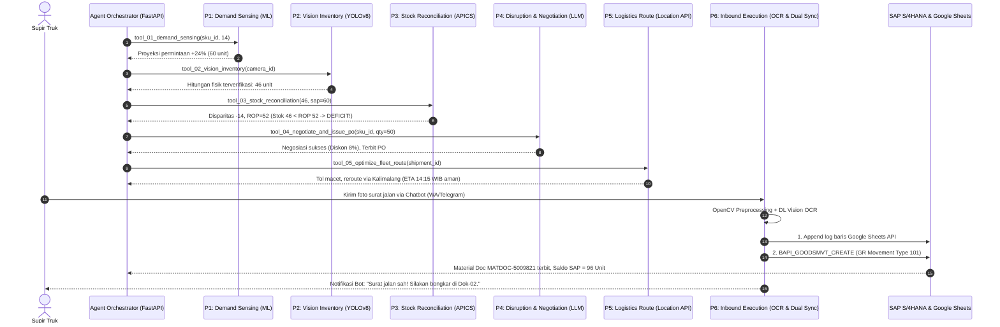

# StockMind AI — System Architecture Specification

**Document ID:** `DOC-FD-04`  
**Document Name:** System Architecture Specification  
**Project Name:** StockMind AI — End-to-End Autonomous Multi-Agent Supply Chain Orchestration System  
**Track:** Intelligent Supply Chain (Sokrates × AWS × SAP Partner — Agentic AI Hackathon 2026)  
**Version:** 1.0.0 (Canonical Production Baseline)  
**Status:** APPROVED  
**Directory:** `stockmind-ai/docs/foundation/04_arsitektur.md`  

---

## 1. Prinsip Desain & Filosofi Arsitektur

Arsitektur StockMind AI mengusung prinsip **Balanced AI Architecture (Anti-Overengineering)**. Sistem tidak memaksakan Machine Learning/LLM pada seluruh domain masalah, melainkan menyinergikan 5 pilar komputasi yang tepat guna:

1. **2x Model Deep Learning:**
   * Model #1: **YOLOv8n Box Detector (Spatial CV)** — Ekstraksi fitur spasial konvolusional pada citra rak gudang (640×640), latensi inferensi CPU ~35 ms (`best.pt`, 5.96 MB).
   * Model #2: **Document Vision OCR** — Ekstraksi teks multi-kolom, stempel cap basah, dan nomor PO dari foto lembaran surat jalan supir truk.
2. **1x Model Machine Learning:**
   * Time-Series Forecasting (LightGBM/Prophet/XGBoost) untuk peramalan kebutuhan 14 hari berbasis data historis dan musiman.
3. **1x Cognitive Agentic LLM:**
   * Qwen 2.5:7b (Ollama lokal) / Claude 3.5 Sonnet (AWS Bedrock) / Gemini 1.5 Flash untuk *diplomacy reasoning*, tawar-menawar harga vendor, dan *tool-calling orchestration*.
4. **2x Mesin Deterministik:**
   * **APICS Standard Inventory Math Engine:** Perhitungan *Safety Stock* dinamis dan *Adaptive Reorder Point* baku ($ROP = d \times L + SS$).
   * **Graph Fleet Route Optimizer:** Algoritma pemetaan rute kendaraan (Dijkstra / VRP) dan integrasi Amazon Location Service.

---

## 2. Diagram Arsitektur 3-Tier Enterprise

```text
┌─────────────────────────────────────────────────────────────────────────────┐
│                    STOCKMIND AI ENTERPRISE ARCHITECTURE                     │
├─────────────────────────────────────────────────────────────────────────────┤
│                                                                             │
│  TIER 1: PERCEPTION & INGESTION (EDGE & DOCUMENT COMPUTER VISION)           │
│  ┌─────────────────────────────────┐   ┌─────────────────────────────────┐  │
│  │ Deep Learning Model #1          │   │ Deep Learning Model #2          │  │
│  │ YOLOv8n Box Detector (Spatial)  │   │ Document Vision OCR (Waybill)   │  │
│  │ - 640x640 CCTV Feed Frame       │   │ - Foto Surat Jalan Kertas Supir │  │
│  │ - mAP@50: 99.50% | Latency: 35ms│   │ - Telegram / WhatsApp Bot API   │  │
│  └────────────────┬────────────────┘   └────────────────┬────────────────┘  │
│                   │                                     │                   │
├───────────────────┼─────────────────────────────────────┼───────────────────┤
│                   ▼                                     ▼                   │
│  TIER 2: DETERMINISTIC BUSINESS MATH, OPTIMIZATION, & DATA STORES           │
│  ┌───────────────────────────────────────────────────────────────────────┐  │
│  │ APICS Standard Inventory Math Engine                                  │  │
│  │ - Dynamic Safety Stock (SS) & Adaptive Reorder Point (ROP = d*L + SS) │  │
│  │ Fleet Route Optimizer (Graph Dispatcher & Telematics)                 │  │
│  │ Dual Synchronization Layer:                                           │  │
│  │ - Google Sheets API (Monitoring Instan Staf Operasional Gudang)       │  │
│  │ - Enterprise ERP Connector: SAP S/4HANA (BAPI_PO & BAPI_GOODSMVT 101) │  │
│  │ Operational Data Store: Amazon DynamoDB & S3 KMS Encrypted Logs       │  │
│  └────────────────┬──────────────────────────────────────────────────────┘  │
│                   │                                                         │
├───────────────────┼─────────────────────────────────────────────────────────┤
│                   ▼                                                         │
│  TIER 3: COGNITIVE AGENTIC ORCHESTRATOR & PRESENTATION                      │
│  ┌───────────────────────────────────────────────────────────────────────┐  │
│  │ Multi-Agent Autonomous Orchestrator (ReAct / Tool-Use Protocol)       │  │
│  │ - Local Provider: Ollama Qwen 2.5 (Offline, 0 Biaya, Privacy Terjaga) │  │
│  │ - Cloud Provider: Amazon Bedrock Claude 3.5 Sonnet                    │  │
│  │ - Serverless API Layer: FastAPI (Uvicorn Async Event Bus, Port 8000)  │  │
│  │ Presentation Dashboard: React 18 + Vite (Tailwind Dark Enterprise)    │  │
│  └───────────────────────────────────────────────────────────────────────┘  │
└─────────────────────────────────────────────────────────────────────────────┘
```

---

## 3. Alur Komunikasi Closed-Loop Multi-Agent (6 Pilar)



---

## 4. Keandalan & Integrasi Layanan Eksternal

1. **AWS Cloud Ecosystem:**
   * **AWS Lambda & S3:** Hosting model serverless `lambda_handler.py` dan penyimpanan artefak citra audit terenkripsi AWS KMS.
   * **Amazon Location Service:** Penyedia data telematri dan routing armada logistik vendor.
   * **Agents for Amazon Bedrock:** Eksekusi model Claude 3.5 Sonnet dengan skema Tool Use standar.
2. **SAP Enterprise Ecosystem:**
   * **SAP S/4HANA MM:** Master saldo inventaris dan mutasi pergerakan barang (Goods Receipt 101).
   * **SAP Ariba:** Jaringan rekanan pengadaan digital untuk transmisi RFQ dan PO.
3. **Google Workspace:**
   * **Google Sheets API:** Sinkronisasi instan dua arah (*Dual Sync*) untuk visibilitas tanpa jeda bagi staf operasional lantai gudang.
